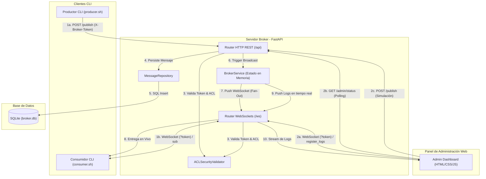
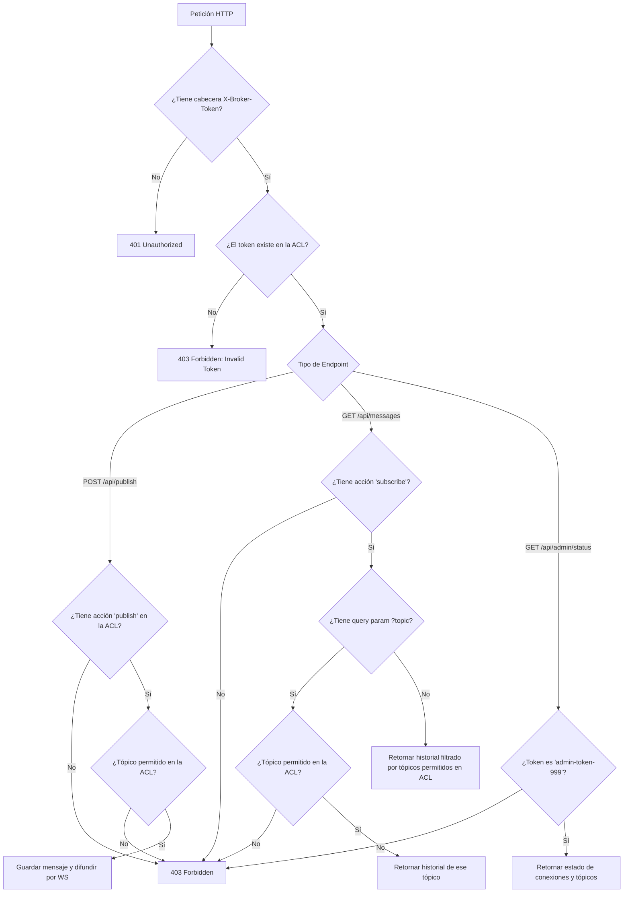
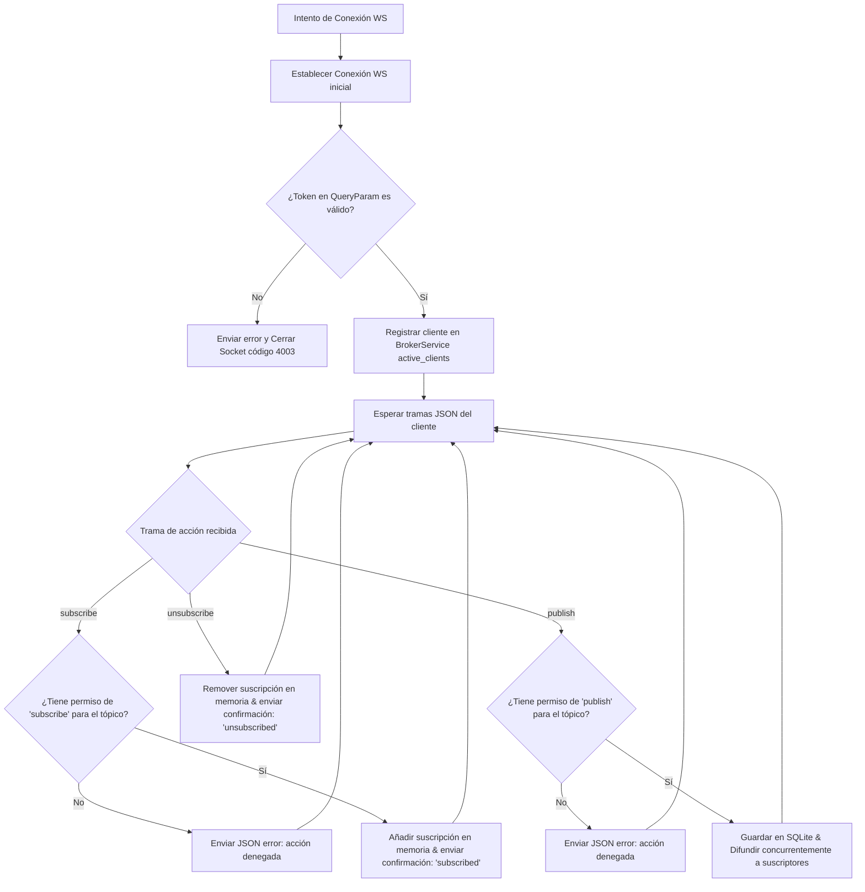

# Custom Message Broker MVP

Este proyecto es una simulación funcional y ligera de un **Broker de Mensajes** desarrollado bajo una arquitectura **Cliente-Servidor**. Ha sido diseñado como un MVP didáctico y robusto para la materia de Sistemas Distribuidos, permitiendo comunicación en tiempo real a través de **WebSockets** y persistencia relacional con **SQLite** (sin ORM, mediante SQL nativo).

---

## 1. Arquitectura Propuesta

El sistema se compone de tres elementos principales y un panel de control centralizado (Dashboard):
1. **Servidor Broker**: Expone una API REST para publicación y un canal de WebSockets bidireccional para suscripciones en tiempo real.
2. **Cliente Productor**: Envía eventos al broker dirigidos a tópicos dinámicos (creados de forma agnóstica).
3. **Cliente Consumidor**: Se conecta al broker, se suscribe a uno o más tópicos y recibe las publicaciones instantáneamente.
4. **Dashboard de Monitoreo**: Muestra la consola de eventos internos del broker (conexiones, desconexiones, envíos y distribuciones) en tiempo real.

### Diagrama de Arquitectura (Mermaid)



---

## 2. Tecnologías Utilizadas

- **Backend**:
  - Python 3.11
  - **FastAPI**: Servidor web ágil e interactivo.
  - **Uvicorn**: Servidor ASGI de alto rendimiento para WebSockets.
  - **aiosqlite**: Acceso asíncrono y directo a base de datos SQLite sin ORM.
  - **Pydantic**: Validación y tipado de payloads de datos.
  - **uv**: Gestor de paquetes y dependencias rápido.
- **Frontend**:
  - **HTML5 / CSS3**: Diseño moderno, glassmorphism con tonalidades oscuras, optimizado para ser responsivo.
  - **Vanilla JavaScript**: Gestión de la conexión WebSocket y dinamismo de la UI.
- **Contenedores**:
  - **Docker & Docker Compose**: Multi-contenedorización y orquestación.

---

## 3. Instrucciones de Instalación y Ejecución

El proyecto está dockerizado por completo. Puedes levantarlo utilizando comandos locales de Docker sin sudo si tu usuario pertenece al grupo docker.

### Prerrequisitos
- Docker instalado.
- Docker Compose v2 instalado.

### Paso 1: Levantar los contenedores
Ejecuta el siguiente comando en la raíz del proyecto para descargar las imágenes base, construir los entornos y arrancar los servicios en segundo plano:

```bash
docker compose up -d --build
```

### Paso 2: Verificar que los contenedores están corriendo
Puedes comprobar el estado de los servicios con:

```bash
docker compose ps
```

Deberías ver dos servicios levantados:
- `broker-server` escuchando en el puerto `8000`.
- `frontend-dashboard` escuchando en el puerto `80`.

---

## 4. Ejemplos de Uso

### A. Panel de Administración Web
Abre tu navegador web y entra a:
👉 [http://localhost](http://localhost)

El panel web opera automáticamente como **Administrador** (usando `admin-token-999` bajo una única conexión WebSocket). Desde allí podrás ver:
1.  **Tarjetas de Estadísticas:** Conexiones activas, tópicos registrados y conteo de mensajes históricos.
2.  **Clientes WebSockets Activos:** Una tabla detallada que muestra el ID de cada cliente conectado, su rol (`admin`, `producer`, `consumer`), IP/puerto de origen y los tópicos a los que está suscrito.
3.  **Consola de Pruebas (Productor):** Un formulario de administración que te permite publicar mensajes directos sobre cualquier tópico para probar y auditar el comportamiento del broker.
4.  **Bitácora y Feeds:** Flujo de mensajes persistidos y registros de auditoría en tiempo real.

---

### B. Pruebas por CLI (Línea de Comandos)

Todos los scripts ejecutables han sido organizados y centralizados en el directorio `./scripts/`.

#### 1. Consola Administrativa TUI en tiempo real:
Inicia una bitácora y monitor de estado interactivo en tu terminal:
```bash
./scripts/admin_monitor.sh localhost 8000 admin-token-999
```

#### 2. Productor Continuo de Mensajes:
Envía mensajes automáticos al broker cada cierto intervalo de tiempo (e.g. cada 3 segundos, con nombre `prod_1`):
```bash
./scripts/producer.sh 8000 prod_1 noticias 3
```

#### 3. Consumidor Interactivo por WebSocket:
Conéctate por WebSocket al broker y suscríbete interactivamente a los tópicos utilizando los comandos de terminal `sub <topic>` y `unsub <topic>`:
```bash
./scripts/consumer.sh 8000 cliente_1 consumer-token-xyz
```

#### 4. Publicar un mensaje rápido usando Curl:
```bash
./scripts/publish.sh "alertas" "Mensaje de prueba crítico"
```

#### 5. Ejecutar la suite de pruebas de ACL:
```bash
./scripts/test_broker.sh
```

---

## 5. Seguridad y Control de Acceso (ACL)

El broker expone un validador de seguridad extensible e inyectable (`BaseSecurityValidator` y `ACLSecurityValidator` en `security.py`). El sistema incluye soporte integrado para autenticación de tokens y autorización fina de tópicos (ACL).

### Tokens Credenciales Predefinidos:
- **`admin-token-999`**: Rol Admin. Autorizado para `publish` y `subscribe` en cualquier tópico (`*`), así como registrarse para recibir logs de servidor.
- **`producer-token-abc`**: Rol Productor. Autorizado únicamente para `publish` en cualquier tópico (`*`). Intentos de subscribir retornarán `403 Forbidden`.
- **`consumer-token-xyz`**: Rol Consumidor. Autorizado para `subscribe` en cualquier tópico (`*`) gracias a la habilitación de suscripciones dinámicas. Intentos de publicar fallarán con `403 Forbidden`.
- **`invalid-token-123`**: Credencial incorrecta. La conexión se cerrará inmediatamente.

---

## 6. Sistema de Logs Centralizado (Patrón Strategy)

El logueo del broker implementa el **Patrón de Diseño Strategy** a través de `CentralizedLogger` y `BaseLogStrategy` (`logger.py`). Permite registrar e interceptar eventos de forma desacoplada.

Las estrategias registradas actualmente son:
1. **ConsoleLogStrategy**: Imprime formateado en la terminal ASGI de Uvicorn.
2. **WebSocketLogStrategy**: Envía los eventos estructurados en vivo al dashboard web de los administradores conectados.

Si se deseara cambiar la implementación a futuro para integrar sistemas externos (como Grafana Loki, Elasticsearch o archivos planos locales), solo se debe heredar de `BaseLogStrategy` y registrar la nueva estrategia, sin alterar un solo flujo interno del servidor.

---

## 7. Estructura del Código

El proyecto sigue una separación limpia de responsabilidades y un límite de **máximo 150 líneas de código por archivo** para asegurar alta modularidad:

- `backend/app/config.py`: Variables de entorno y configuración.
- `backend/app/database.py`: Creación de la base de datos SQLite y dependencias de sesión.
- `backend/app/models.py`: Esquemas de datos para el validador Pydantic.
- `backend/app/repositories/message_repository.py`: Capa de acceso a base de datos mediante queries SQL puras.
- `backend/app/services/broker_service.py`: Lógica de suscripción in-memory y logeo de eventos del broker.
- `backend/app/services/message_service.py`: Capa lógica que une base de datos y envío WebSocket.
- `backend/app/routers/http_router.py`: Endpoints REST del broker y APIs administrativas.
- `backend/app/routers/ws_router.py`: Endpoints WebSocket de comunicación interactiva.
- `backend/app/main.py`: Entrada e inicialización del servidor FastAPI.
- `scripts/`: Contiene los archivos ejecutables `.sh` de control.
- `scripts/python/`: Scripts complementarios interactivos en Python.
- `docs/`: Documentación técnica extendida del sistema.

---

## 8. Flujo de Validación de Tokens y Seguridad (Diagramas)

La validación de tokens y políticas de control de acceso (ACL) se realiza de forma estricta tanto en las peticiones HTTP REST como en la conexión persistente por WebSockets:

### A. Flujo de Validación en Rutas HTTP REST
Cada endpoint REST valida la autenticidad del token mediante el header `X-Broker-Token` y delega en el autorizador la viabilidad de la operación:



### B. Flujo de Validación y Acciones en WebSockets
En WebSockets, el token se envía en el handshake mediante query parameters. Las suscripciones y publicaciones solicitadas por tramas de texto JSON se autorizan en caliente sobre la misma conexión:



---

## 9. Arquitectura y Patrones de Diseño Implementados

Este MVP se diseñó siguiendo principios SOLID y patrones estructurados para asegurar alta cohesión y bajo acoplamiento:

1.  **Singleton Pattern (Patrón Unico):** 
    Implementado en `BrokerService` (`broker_instance`). Sirve como un único registro centralizado en memoria de todas las conexiones activas y canales de suscripción del servidor.
2.  **Strategy Pattern (Patrón Estrategia):**
    *   **Seguridad:** La validación de credenciales hereda de la clase base abstracta `BaseSecurityValidator`. Esto permite intercambiar la estrategia de autorización local (ACL estática) por una validación OIDC/OAuth2 externa sin modificar los controladores de FastAPI.
    *   **Bitácora:** `CentralizedLogger` propaga logs concurrentemente a través de estrategias que heredan de `BaseLogStrategy`, desacoplando la lógica de negocio de los destinos de salida (consola local o WebSockets de la UI).
3.  **Repository Pattern (Patrón Repositorio):**
    `MessageRepository` encapsula y aísla por completo el acceso a la base de datos a través de consultas SQL crudas. Los servicios y rutas no conocen los detalles de infraestructura o persistencia.
4.  **Dependency Injection (Inyección de Dependencias):**
    Utilizado nativamente mediante FastAPI `Depends` en las rutas HTTP y WebSocket para entregar instancias de bases de datos, repositorios, servicios y seguridad de manera limpia.

---

## 10. Acceso a la Base de Datos SQLite

La persistencia del broker se gestiona mediante un motor SQLite asíncrono (`aiosqlite`). La base de datos es almacenada físicamente dentro del volumen persistente de Docker.

### A. Inspección directa por consola de comandos:
Para interactuar con la base de datos de manera directa y consultar los mensajes persistidos:
```bash
docker exec -it broker-server sqlite3 /app/data/broker.db
```

Dentro del prompt interactivo de SQLite (`sqlite>`), utiliza los siguientes comandos:
*   Activar vista formateada:
    ```sql
    .headers on
    .mode column
    ```
*   Listar las tablas existentes:
    ```sql
    .tables
    ```
*   Consultar los últimos 10 mensajes enviados por cualquier tópico:
    ```sql
    SELECT * FROM messages ORDER BY id DESC LIMIT 10;
    ```
*   Salir de SQLite:
    ```bash
    .quit
    ```

### B. Inspección gráfica mediante software GUI:
Si deseas utilizar herramientas gráficas como **DB Browser for SQLite** o **DBeaver**:
1.  Busca el punto de montaje local del volumen docker:
    ```bash
    docker volume inspect message-broker_broker-data
    ```
2.  Abre el visor en tu sistema apuntando al archivo `broker.db` ubicado dentro de la ruta `Mountpoint` entregada por Docker.

---

## 11. El Modelo Pub/Sub frente a las Colas de Mensajes

Es fundamental comprender que el **Message Broker** implementa un modelo de **Publicación y Suscripción (Pub/Sub)** del tipo **Fan-Out** (Difusión):

```
                       ┌───► [Consumidor A (Tópico 'alertas')]
[Productor] ──► Tópico ┼───► [Consumidor B (Tópico 'alertas')]
                       └───► [Consumidor C (Tópico 'alertas')]
```

### Características del Modelo Pub/Sub (Implementado en este Proyecto)
*   **Distribución Uno a Muchos (Fan-Out):** Cada mensaje publicado en un tópico se duplica y se envía a **todos** los consumidores que se encuentren suscritos a dicho tópico en tiempo real.
*   **Desacoplamiento Absoluto:** El productor no requiere conocer quién o cuántos consumidores leerán el mensaje. El broker simplemente distribuye a los sockets conectados de manera instantánea.

### Diferencia con el Modelo de Cola de Mensajes (Queues)
En un sistema de colas punto a punto (e.g. colas de trabajo en RabbitMQ):
*   El objetivo es la distribución y balanceo de carga de trabajo.
*   Un mensaje colocado en la cola es entregado a **un único consumidor** disponible.
*   El mensaje se bloquea e impide que otros lo consuman. Solo se elimina de la cola una vez que ese consumidor específico envía una confirmación satisfactoria (`ACK`).


