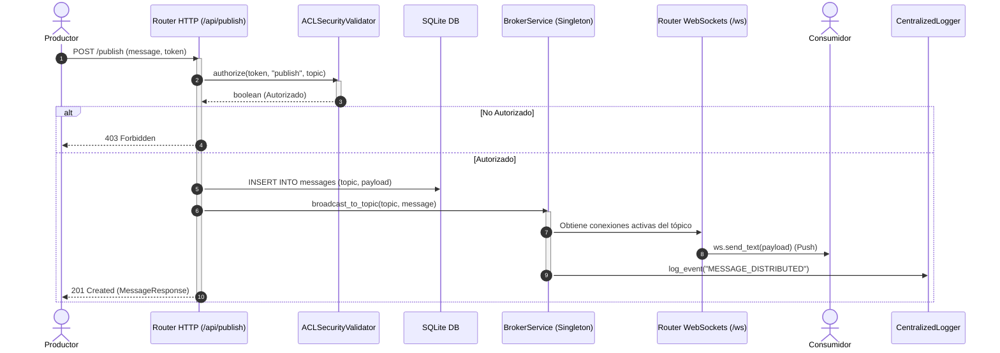
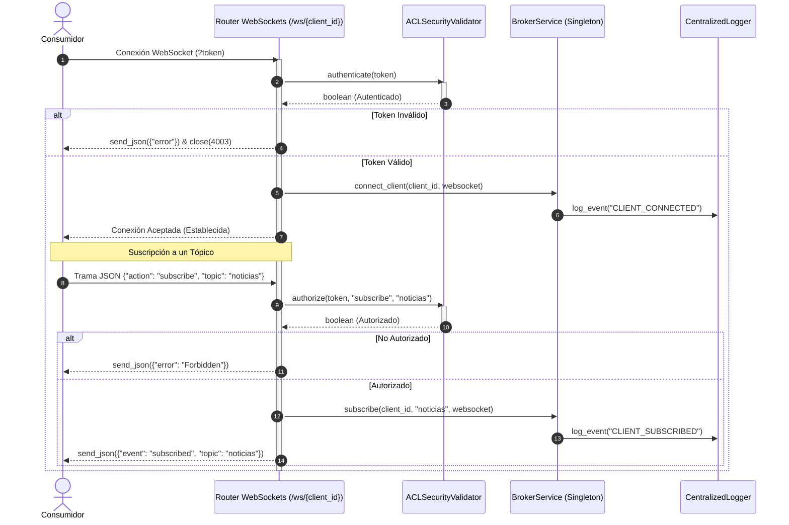

# Documentación Técnica: Funcionamiento Interno del Broker de Mensajes

Este documento detalla el funcionamiento interno de la aplicación y el flujo secuencial de procesamiento y distribución de los mensajes en el sistema.

---

## 1. Funcionamiento del Broker

El servidor del broker actúa como un intermediario o concentrador de comunicaciones (*hub*). Su diseño se basa en un desacoplamiento temporal y espacial entre los clientes productores y los consumidores.

### Características Clave de la Implementación

1. **Gestión In-Memory de Suscripciones**: 
   - El servicio `BrokerService` mantiene mapas que relacionan tópicos con colecciones activas de sockets de clientes de forma dinámica.
2. **Persistencia Transaccional (SQLite)**: 
   - Cada mensaje recibido y autorizado se guarda en una base de datos SQLite de manera asíncrona mediante consultas SQL puras (no-ORM) antes de su distribución.
3. **Control de Acceso Fino (ACL y Seguridad)**:
   - Implementa el patrón Strategy para la validación de seguridad a través de la interfaz `BaseSecurityValidator`. La implementación concreta `ACLSecurityValidator` valida la autenticidad de los tokens y autoriza las acciones (`publish` o `subscribe`) según el tópico en base a una Lista de Control de Acceso (ACL).
4. **Sistema de Logs Centralizado (Patrón Strategy)**:
   - Los eventos críticos (conexiones, publicaciones, despachos) se reportan a un `CentralizedLogger` global que delega a múltiples estrategias registradas (`ConsoleLogStrategy` y `WebSocketLogStrategy`). Esto permite incorporar nuevos colectores de logs (ej. bases de datos de auditoría, archivos planos o servicios cloud) sin modificar la lógica del broker.
5. **Agnosticismo de Tópicos**: 
   - El broker no requiere pre-configurar qué tópicos existen. Cualquier canal solicitado por productores autorizados es creado dinámicamente.

---

## 2. Flujo de Mensajes y Secuencia de Procesamiento

El sistema gestiona el ciclo de vida de los mensajes y de las conexiones mediante los siguientes flujos estructurados en diagramas de secuencia Mermaid:

### A. Diagrama de Secuencia de Publicación y Distribución (REST a WebSocket)
Este diagrama ilustra la secuencia desde que un productor publica un mensaje por HTTP hasta que el broker lo persiste en SQLite y lo distribuye concurrentemente en tiempo real a los consumidores WebSockets suscritos:

### B. Diagrama de Secuencia de Conexión y Suscripción WebSocket
Este diagrama ilustra el flujo de control de acceso durante el handshake inicial de un WebSocket y el procesamiento dinámico de solicitudes de suscripción sobre la conexión persistente:

---

## 3. Detalle de las Etapas del Ciclo de Vida

1. **Publicación y Validación de Entrada:** El productor realiza un envío (REST POST o trama WebSocket). El middleware de seguridad valida el token en base a la ACL. Si falla, el flujo se corta inmediatamente con un código HTTP `403` o cierre de socket `4003`.
2. **Persistencia Transaccional:** Si la acción es aprobada, el mensaje se registra de manera asíncrona en SQLite. Esto garantiza que existirá un historial auditable accesible por REST (`GET /api/messages`).
3. **Distribución en Tiempo Real (Fan-Out):** `BrokerService` extrae la lista de WebSockets de los consumidores suscritos en memoria y realiza un despacho concurrente (`asyncio.gather`). Si un socket se detecta roto o inactivo durante el envío, se desencadena su desconexión automática y remoción de memoria.
4. **Logueo Desacoplado:** Al concluir la distribución, se propaga el evento al `CentralizedLogger` para que las estrategias activas (consola local y WebSocket de auditoría para la UI) actualicen sus paneles correspondientes.

